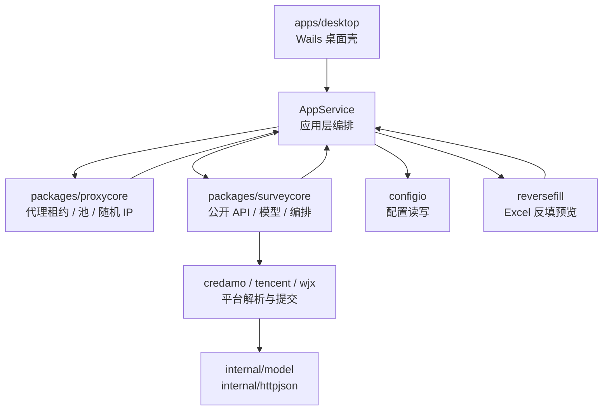
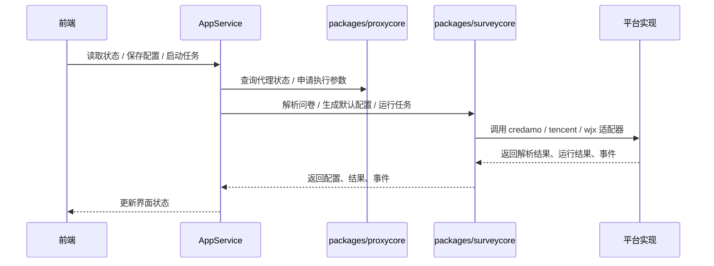

<div align="center">
  
  <h1>SurveyController</h1>
  
  [](https://github.com/SurveyController/SurveyController/stargazers)
  
  [](./LICENSE)
  [](https://go.dev/)
  [](https://wails.io/)
  [](https://www.typescriptlang.org/)
  [](https://tailwindcss.com/)

  <p><strong>一站式问卷自动化处理程序，适配问卷星、腾讯问卷、Credamo见数平台</strong></p>
  <p>支持指定ip填写地区、信度系数、作答时长与分布比例</p>
  
</div>

> [!WARNING]
> **该项目仅供 HTTP 接口自动化学习与测试使用。** 请确保拥有目标测试问卷的授权再使用，**严禁污染他人问卷数据！**

---

## 主要特性

1. **多平台支持** - 同时支持问卷星、腾讯问卷、Credamo见数平台，一套工具搞定三个平台
2. **Fluent 界面** - 无需复杂配置，通过可视化UI完成所有操作
3. **支持二维码解析** - 拖入问卷二维码图片自动转链接
4. **定制答案比例** - 支持自定义各选项权重与多选题命中概率分布
5. **指定ip地区** - 支持随机IP或指定特定地区IP提交
6. **配置导入导出** - 保存配置文件便于后续复用，跨设备同步
7. **AI 主观题作答** - 填空题自动生成作答内容（限时免费），由 [@dAwn-Rebirth](https://github.com/dAwn-Rebirth) 和 [@LING71671](https://github.com/LING71671) 贡献

## 开始使用

> [!TIP]
> **安装包：** 前往 [发行版](https://github.com/SurveyController/SurveyController/releases/latest) 下载最新版本 .exe 安装包，安装后直接运行即可

建议配合[教程文档](https://surveydoc.hungrym0.com/)食用。二开可前往 [SurveyCore](https://github.com/SurveyController/SurveyCore)

### 从源码运行

**环境要求：** Go 1.26+，Git，Node.js，npm，Wails v3

当前只发布 Windows 安装包。
macOS 可从源码启动，不提供打包分发。

<details>
<summary>Windows 使用</summary>

安装 Wails CLI：
```powershell
go install github.com/wailsapp/wails/v3/cmd/wails3@latest
```

克隆、安装前端依赖、运行桌面端：
```bash
git clone https://github.com/SurveyController/SurveyController.git
cd SurveyController
go test ./packages/proxycore/... ./packages/surveycore/...
cd apps/desktop/frontend
npm ci
cd ..
wails3 generate bindings
wails3 dev
```

</details>

<details>
<summary>macOS 使用</summary>

安装基础工具和 Wails CLI：
```bash
brew install go git node
go install github.com/wailsapp/wails/v3/cmd/wails3@latest
```

克隆、安装前端依赖、运行桌面端：
```bash
git clone https://github.com/SurveyController/SurveyController.git
cd SurveyController
go test ./packages/proxycore/... ./packages/surveycore/...
cd apps/desktop/frontend
npm ci
cd ..
wails3 generate bindings
wails3 dev
```

</details>

## 使用方法

1. **输入问卷** - 粘贴问卷链接，或上传/拖入二维码图片
2. **自动解析** - 点击 `自动配置问卷`，自动识别平台和题目结构
3. **调整配置** - 在配置向导中，拖动滑块对各题设置答案权重和概率分布
4. **设置运行参数** - 指定目标提交份数、并发数、随机IP等设置项
5. **启动任务** - 点击 `开始执行` 并等待任务完成

## 关键配置说明

| 配置项 | 说明 |
|--------|------|
| **目标份数** | 计划提交的问卷总数。建议先测试 3~5 份，确认配置没问题后再增加 |
| **并发数** | 同时提交的任务数量。并发越高速度越快，但失败率也可能更高 |
| **AI 填空** | 开启后可自动生成填空题内容。需要先确认 AI 配置可用 |
| **随机 IP** | 使用代理 IP 模拟不同地区访问。会消耗随机 IP 额度或自备代理资源 |
| **User-Agent** | HTTP 请求标识，决定问卷后台看到的访问设备来源 |
| **作答时长** | 控制每份问卷提交时的作答时长参数 |

详细配置项请参考[教程文档](https://surveydoc.hungrym0.com/runtime.html)。

## 技术架构





## 交流群

如有疑问或需要技术支持，可加入QQ群：
346131215


## 参与贡献

欢迎提交 Pull Request，改进方向包括但不限于：
- 增加对更多题型的支持
- 增加对更多问卷平台的支持
- 性能优化与代码重构

## 贡献者

感谢以下贡献者对本项目的支持：

<div style="display: flex; gap: 10px;">
  <a href="https://github.com/shiaho777">
    
  </a>
  <a href="https://github.com/BingBuLiang">
    
  </a>
  <a href="https://github.com/dAwn-Rebirth">
    
  </a>
  <a href="https://github.com/Moyuin-aka">
    
  </a>
  <a href="https://github.com/zioug">
    
  </a>
  <a href="https://github.com/qintaiyang">
    
  </a>
  <a href="https://github.com/LING71671">
    
  </a>
</div>

## Star History

[](https://www.star-history.com/#SurveyController/SurveyController&type=date&legend=top-left)
